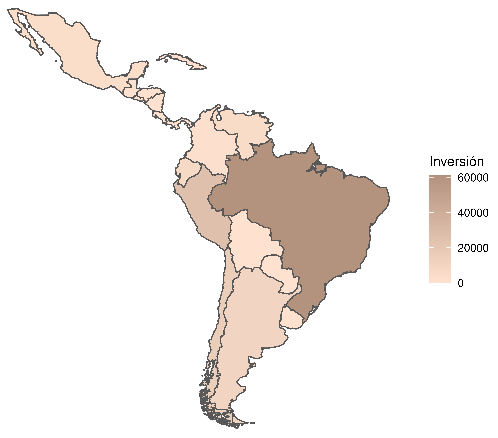

## Creación de mapas en r

Si de mostrar comparativo entre países se trata, los mapas siempre son una gran opción para darle mayor atractivo a tus visualizaciones.
Para la creación del Mapa sobre inversión china en latinoamérica se utilizó los datos publicados por [China Global Investment Tracker](https://www.aei.org/china-global-investment-tracker/) Si estas interesado en aprender como realizar este tipo de gráfico puedes replicarlo utilizando el script y la base de datos adjunta.

### Inversión china en latinoamérica (2005-2021)

