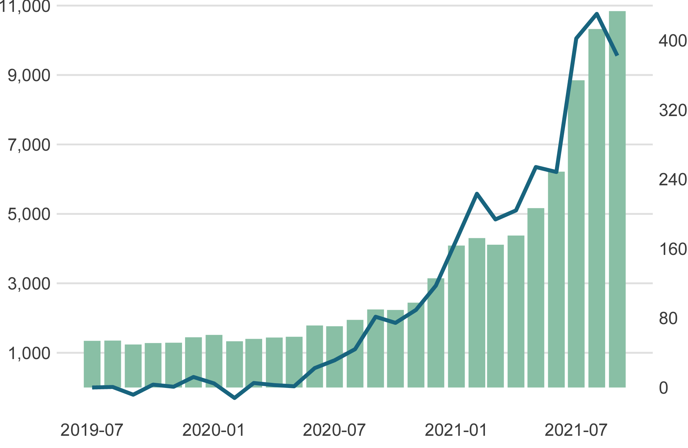

## Gráfico de líneas y barras combinado | Combined line and bar chart 

En algunas ocasiones ocurre que tiene el objetivo de comparar dos variables con métricas diferentes, por ejemplo, una variable en niveles vs su tasa de crecimiento. Lo que dificulta
la visualización de los datos, ya que, como tienen diferente escala no es posible visualizarlos de forma clara. Sin embargo, una de las estrategias a tomar en este tipo de situaciones
es utilizar dos ejes y dos tipos de gráficos. En este caso, un gráfico de línea que representa el crecimiento interanual del [Índice global de tarifas de transporte de contenedores (Dólares)](https://www.statista.com/statistics/1250636/global-container-freight-index/)
### Crisis de los contenedores | Índice global de tarifas de transporte de contenedores (Dólares) 📈

### Fuentes:
- [Combine bar and line chart in ggplot2 in R](https://www.geeksforgeeks.org/combine-bar-and-line-chart-in-ggplot2-in-r/)
- [Statista](https://www.statista.com/statistics/1250636/global-container-freight-index/)

