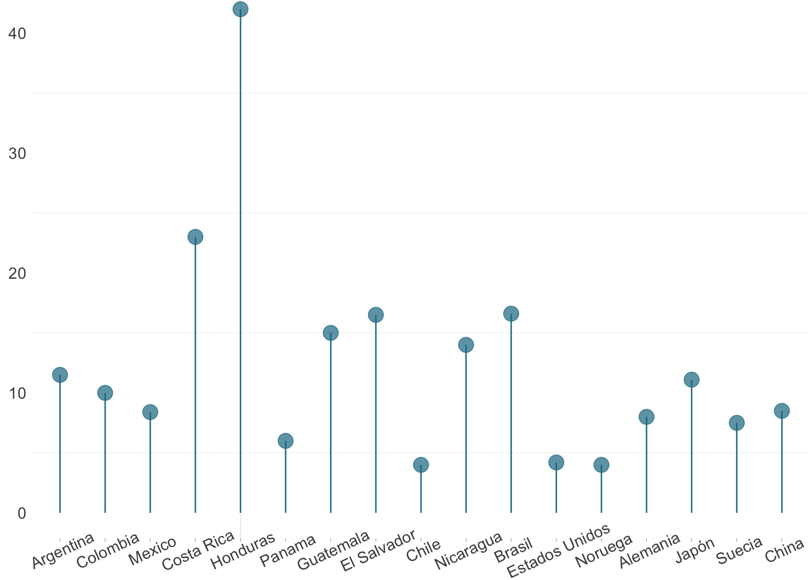

## Gráfico de paleta | Lollipop chart

Si haz llegado hasta aquí es porque de seguro estás cansado de gráficos de línea y barras, quieres algo diferente. Bueno, esa es uno de los motivos principales para usar un _Lollipop Chart_. Otra de las razones puede ser que deseas mostrar progresos, tiempos, distancias, inicio y fin con tu conjunto de datos.

### Cantidad de días necesarios para completar los procedimientos para operar legalmente una empresa

### Fuentes:
- [Mount, G. (2021) Advancing into Analytics](https://www.oreilly.com/library/view/advancing-into-analytics/9781492094333/)
- [Statista](https://www.statista.com/statistics/1250636/global-container-freight-index/)

